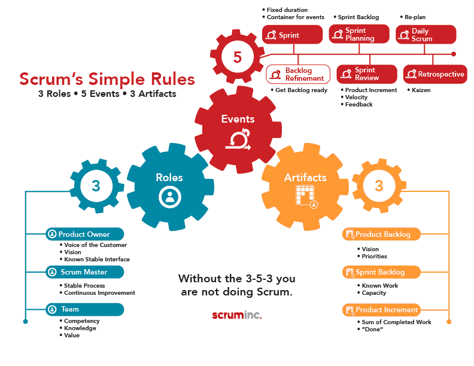
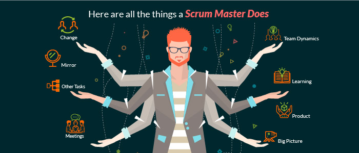
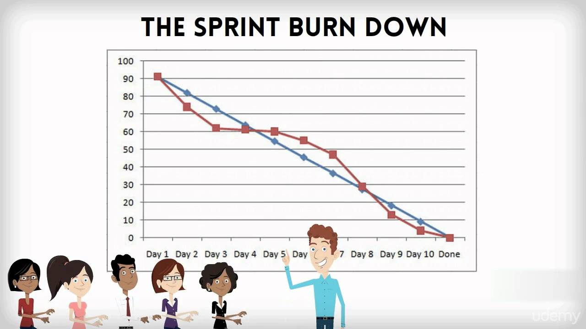

summary: Agile 101
id: agile101
categories: Sample
tags: devops
status: Published 
authors: Kewei Zhang

# Agile 101
<!-- ------------------------ -->
## Overview
Agile 101 is the foundation course for all students in IT industry. This course covers a full spectrum of knowledge about Agile, Scrum and how to apply those knowledge in real project scenarios.

<!-- ------------------------ -->
## Agile Fundamentals and Mindset

### What is Agile
Agile is an iterative approach to project management and software development that helps teams deliver value to their customers faster and with fewer headaches. Instead of betting everything on a "big bang" launch, an agile team delivers work in small, but consumable, increments. Requirements, plans, and results are evaluated continuously so teams have a natural mechanism for responding to change quickly.

### The Agile Manifesto
[The Agile Manifesto](http://agilemanifesto.org/)
- Individuals and interactions over processes and tools
- Working software over comprehensive documentation
- Customer collaboration over contract negotiation
- Responding to change over following a plan

### Kanban
Kanban is a popular framework used to implement agile software development. It requires real-time communication of capacity and full transparency of work. Work items are represented visually on a kanban board, allowing team members to see the state of every piece of work at any time.

#### Kanban Artifects
- Kanban Board
- Kanban Cards
- WIP limit

#### Kanban Six Core Practices
- Visualize the workload
- Limit work in Progress
- Manage flow of work
- Make policies explicit
- Implement feedback loops
- Continiously improve

<!-- ------------------------ -->
## Scrum, Roles and collaborations

### What is Scrum
Scrum is a framework that helps teams work together. Much like a rugby team (where it gets its name) training for the big game, Scrum encourages teams to learn through experiences, self-organize while working on a problem, and reflect on their wins and losses to continuously improve. Scrum describes a set of meetings, tools, and roles that work in concert to help teams structure and manage their work.

### Scrum 3-5-7

#### 3 Roles
- Product Owner
- Scrum Master
- Team Members

#### 5 Ceremonies
- Sprint Planning
- Daily Standup
- Product Backlog Refinement (PBR)/ Backlog Grooming
- Sprint Review
- Sprint Retrospective

#### 7 Artifacts
- Product Backlog
- Sprint Backlog
- Product Increment
- Definition of Ready (DoR)
- Definition of Done (DoD)
- Impediment List
- Burndown Chart

### What is Sprint

A sprint is a short, time-boxed period when a scrum team works to complete a set amount of work. Sprints are at the very heart of scrum and agile methodologies, and getting sprints right will help your agile team ship better software with fewer headaches.  

### The Product Owner (PO)
The Product Owner is one of the key roles in Scrum, with specific duties and responsibilities to help a team to be successful. They are the voice of the customer and collaborate with a range of stakehodlers and sponsors to create the product vision while managing expectations.

Effective Product Owners continuously maintain their Product Backlogs and provide clarifing communication to the teams.

To be successful, Product Owners must be supported by the organization with respect to their decisions, which are reflected in the items in their Product Backlogs, as well as having a solid understanding of the role themselves.

Being co-located with their teams helps to drive success of the project by shortening the lines of communication.

Product Owners should be responsible to:
- Creates and communicates product vision to team members
- Manges stakeholders expectations by representing their wishes
- Creates initial Product Backlog and continously prioritizes and maintains it thoughout the execution of the Agile project
- Accepts completed work performed by the Team
- Participate in Sprint activieis with varying capacity

### The Scrum Master
The Scrum Master is a role within Scrum that helps to shepherd teams through their activies by being a servant leader as well as helping to foster self-organization. They ensure that Scrum is understood by team mebers and coach individuals on ways to best leverage Scrum to maximize success for the project.

Scrum Masters have no autority to make decisions or commitments for the Team.

The Scrum Master is responsible to 
- Own the Agile process
- Support the Product Owner to help create and maintain the Product Backlog
- Works with the Team to discover and implement practices supporting the Definition of Done
- Removes impediments that are holding up the Team's progress
- Shields team members from external distractions
- Coaches the Team in the adoption of Agile process
- Organizes and facilitates Sprint ceremonies and activities
- Creates transparency by creating inforation radiators

### The Team
This group of individuals is the driving force befind the work being performed. The team is not tasked with assignments; it self-organizes to accomplish items identified that proivde the most value. 

The Scrum Team is responsible to:
- Create and manage the Sprint Backlog
- Provide story level estimates as a group
- Makes commitment as a Team for a given Sprint
- Identify tasks that comprise a user story
- Provide task-level estimates on an individual basis
- Remains focused by reviewing progress regularly
- Provides alternative delivery options
- Communicates issues and impediments to the Scrum master
- Shares/changes responsibilities fo the team members when needed

#### Guidelines for effective teams
- Optimal size is no less than 3 and no more than 9 individuals (PO, and Scrum master are not included unless executing the work of the Sprint Backlog)
- Contain the necessary skillsets needed to deliver items of value
- Have dedicated team members, rather than havving them spread across multiple groups.

<!-- ------------------------ -->
## User Stories and Estimation

### Product Backlog
A product backlog is a prioritized list of work for the development team that is derived from the roadmap and its requirements. The most important items are shown at the top of the product backlog so the team knows what to deliver first.

The development team pulls work from the product backlog as there is capacity for it, either continually (kanban) or by iteration (scrum).  

### Epics
An agile epic is a body of work that can be broken down into specific tasks (called "stories," or "user stories") based on the needs/requests of customers or end users.

### User Stories
A user story is the smallest unit of work in an agile framework. It’s an end goal, not a feature, expressed from the software user’s perspective.

Stories use non-technical language to provide context for the development team and their efforts. After reading a user story, the team knows why they are building what they're building and what value it creates. 

#### User Story Template and Examples
User stories are often expressed in a simple sentence, structured as follows:

"As a [persona], I [want to], [so that]."

### Planning Poker

Estimation is hard. It must take into account a slew of factors that help product owners make decisions that affect the entire team–and the business.

In agile development, the product owner is tasked with prioritizing the backlog–the ordered list of work that contains short descriptions of all desired features and fixes for a product. Product owners capture requirements from the business, but they don’t always understand the details of implementation. So good estimation can give the product owner new insight into the level of effort for each work item, which then feeds back into their assessment of each item's relative priority.

Involving everyone (developers, designers, testers, deployers... everyone) on the team is key. Each team member brings a different perspective on the product and the work required to deliver a user story. For example, if product management wants to do something that seems simple, like support a new web browser, development and QA need to weigh in because their experience has taught them what dragons may be lurking beneath the surface.

#### Story points vs. hours
Traditional software teams give estimates in a time format: days, weeks, months. Many agile teams, however, have transitioned to story points. Story points rate the relative effort of work in a Fibonacci-like format: 0, 0.5, 1, 2, 3, 5, 8, 13, 20, 40, 100. It may sound counter-intuitive, but that abstraction is actually helpful because it pushes the team to make tougher decisions around the difficulty of work.

#### Story points and planning poker
Teams starting out with story points use an exercise called planning poker. The team will take an item from the backlog, discuss it briefly, and each member will mentally formulate an estimate. Then everyone holds up a card with the number that reflects their estimate. If everyone is in agreement, great! If not, take some time (but not too much time–just couple minutes) to understand the rationale behind different estimates. Remember though, estimation should be a high level activity. If the team is too far into the weeds, take a breath, and up-level the discussion.

<!-- ------------------------ -->
## Scrum Ceremonies

### Sprint Planning

Sprint planning is an event in scrum that kicks off the sprint. The purpose of sprint planning is to define what can be delivered in the sprint and how that work will be achieved. Sprint planning is done in collaboration with the whole scrum team.

#### Sprint Backlog
The sprint backlog is a list of tasks identified by the Scrum team to be completed during the Scrum sprint. During the sprint planning meeting, the team selects some number of product backlog items, usually in the form of user stories, and identifies the tasks necessary to complete each user story.

### Daily Standup
A stand-up is a daily meeting that involves the core team: product owners, developers, and the scrum master. This meeting’s flavor is unique to each team, but normally consists of three simple questions to generate structure:

- What did I work on yesterday?
- What am I working on today?
- What issues are blocking me?

#### Impediment List

An Impediment List is a collection of items that are negatively affecting The Team's ability to achieve their Sprint goals by vlocking progress on one or more User Stories in the Sprint Backlog. Impediments are normally tracked in the same locations as the Sprint Backlog to show the blocked item but they can also be tracked in a separately maintained artifact. The Scrum Master is responsible for capturing impediments during the Daily Standup and throughout the Sprint. Some examples of the common impediments are:
- Unexpected time off by a team member
- Missing resources (e.g. required software tools, infrastructure, or network access)
- Unanswered quesitons from the customer/ client, Subject Matter Experts (SME) or the Product Onwer

#### Sprint Burndown Chart
The Sprint Burndown Chart makes the work of the Team visible. It is a graphic representation that shows the rate at which work is completed and how much work remains to be done. The chart slopes downward over Sprint duration and across Story Points completed.

**Burndown Chart Example**

#### Definition of Ready (DoR)
Having a Definition of Ready means that stories must be immediately actionable. The Team must be able to determine what needs to be done and the amount of work required to complete the User Story

#### Definition of Done (DoD)
A Definition of Done is a clear and concise list of requirements that software must adhere to for the team to call it complete.

### Product Backlog Refinement (PBR) / Backlog Grooming
Product Backlog Refinement is the act of adding detail, estimates, and order to items in the Product Backlog. This is an ongoing process in which the Product Owner and the Development Team collaborate on the details of Product Backlog items. During Product Backlog refinement, items are reviewed and revised. The Scrum Team decides how and when refinement is done. Refinement usually consumes no more than 10% of the capacity of the Development Team. However, Product Backlog items can be updated at any time by the Product Owner or at the Product Owner’s discretion.

### Sprint Review / Showcase
A sprint review is about demonstrating the hard work of the entire team: designers, developers, and the product owner. Team members gather around a desk for informal demos and describe the work they’ve done for that iteration. It’s a time to ask questions, try new features, and give feedback. Sharing in success is an important part of building an agile team.

#### Product Increment
The Product Increment is the sum of all the Product Backlog items completed during a Sprint and the value of the increments of all previous Sprints. At the end of a Sprint, the new Increment must be “Done,” which means it must be in useable condition and meet the Scrum Team's definition of “Done”

#### Velocity
In agile velocity is the amount of work done during a sprint. In agile, velocity provides the distance your team travel to reach to the sprint objective.

In agile Velocity help you to understand how long it will take your team to finish the whole backlog. In general, it takes few sprint to get to know the team velocity.
I average the amount of user story completed by your team in for e.g past three sprint take the average of it is your team velocity. Assuming your team is completing 5-7 user stories in each sprint with total story points of 25-35. So, the average velocity of team in past three is 25 – 35

### Sprint Retrospective
A retrospective is anytime your team reflects on the past to improve the future. Between technical and non-technical teams, you can retro on just about anything! Right now, we're hosting a public retrospective on agile software development. Help define the future of agile by adding some of your ideas to our board. 

<!-- ------------------------ -->
## Excercises

### Write down Scrum 3-5-7

#### 3 Roles

#### 5 Ceremonies

#### 7 Artifacts

### Map Responsibilities with Roles

1. Coaches the Team in the adoption of Agile process
2. Makes commitment as a Team for a given Sprint
3. Support the Product Owner to help create and maintain the Product Backlog
4. Identify tasks that comprise a user story
5. Creates initial Product Backlog and continously prioritizes and maintains it thoughout the execution of the Agile project
6. Creates and communicates product vision to team members
7. Shields team members from external distractions
8. Coaches the Team in the adoption of Agile process