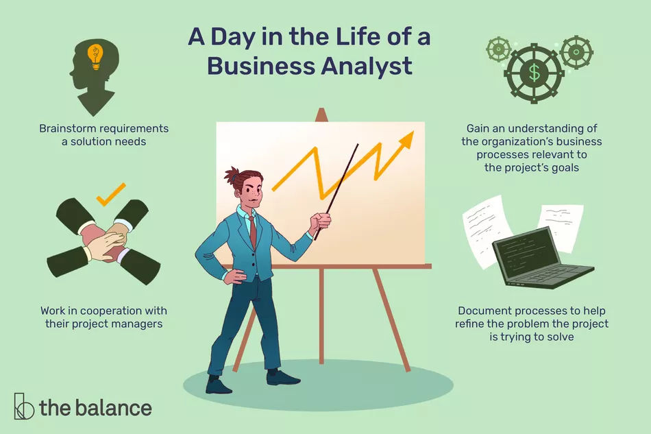
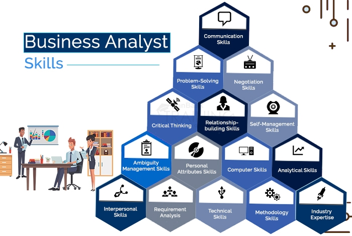
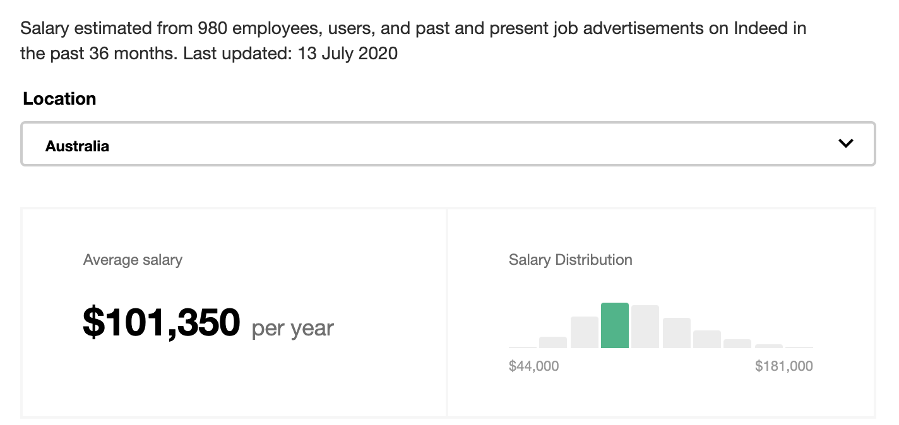
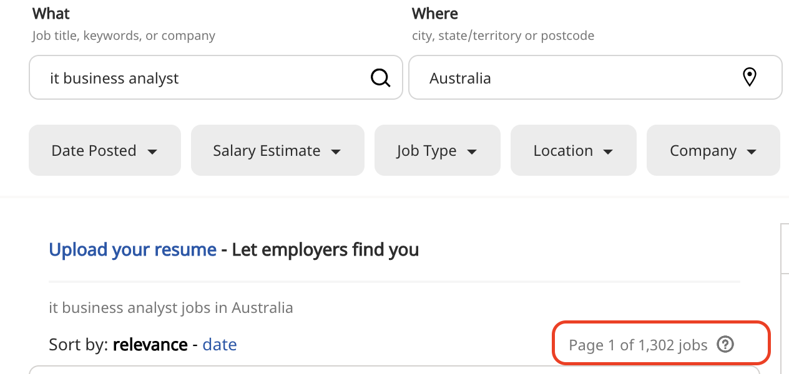

summary: Business Analyst Career Development
id: ba_career_dev
categories: Sample
tags: career_dev
status: Published 
authors: Kewei Zhang

# Business Analyst Career Development

<!-- ------------------------ -->
## Overview 
Business analyst help guide businesses in improving processes, products, services and software through data analysis. These agile workers straddle the line between IT and the business to help bridge the gap and improve efficiency.

## What is Business Analyst
Business analysts (BAs) are responsible for **bridging the gap between IT and the business** using data analytics to assess processes, determine requirements and deliver data-driven recommendations and reports to executives and stakeholders.

BAs engage with business leaders and users to understand how data-driven changes to process, products, services, software and hardware can **improve efficiencies and add value**. They must articulate those ideas but also balance them against what’s technologically feasible and financially and functionally reasonable. Depending on the role, you might work with data sets to improve products, hardware, tools, software, services or process.

## Job Description
IT Business Analysts are responsible for enhancing the quality of IT products and services, analyzing data to inform business decisions and finding technological solutions to business needs, among other duties.

## Responsibility
*"Identifying and then prioritizing technical and functional requirements tops the business analyst's list of responsibilitie. Elicitation of requirements and using those requirements to get IT onboard and understand what the client really wants, that’s one of the biggest responsibilities for BAs."* 
-- Bob Gregory, a professor and academic program director for the business analysis and management degree program at Bellevue University.

- Creating a detailed business analysis, outlining problems, opportunities and solutions for a business
- Budgeting and forecasting
- Planning and monitoring
- Variance analysis
- Pricing
- Reporting
- Defining business requirements and reporting them back to stakeholders

## Skills and Experiences

According to the IIBA some of the most important skills and experience for a business analyst are:

- Oral and written communication skills
- Interpersonal and consultative skills
- Facilitation skills
- Analytical thinking and problem solving
- Being detail-oriented and capable of delivering a high level of accuracy
- Organizational skills
- Knowledge of business structure
- Stakeholder analysis
- Requirements engineering
- Costs benefit analysis
- Processes modeling
- Understanding of networks, databases and other technology

## Salary Scale
### [Average Business Analyst, IT Salary in Australia](https://www.payscale.com/research/AU/Job=Business_Analyst%2C_IT/Salary)

### [Popular Employer Salary for Business Analyst, IT](https://www.payscale.com/research/AU/Job=Business_Analyst%2C_IT/Salary)

### [Business Analyst Salaries in Australia](https://au.indeed.com/salaries/business-analyst-Salaries)

### [Number of Open Opportunities](https://au.indeed.com/jobs?q=it+business+analyst&l=Australia)

## Career Path

- Junior Business Analyst 
- Business Analyst
- Senior Business Analyst
- Integration Manager
- Product Manager
