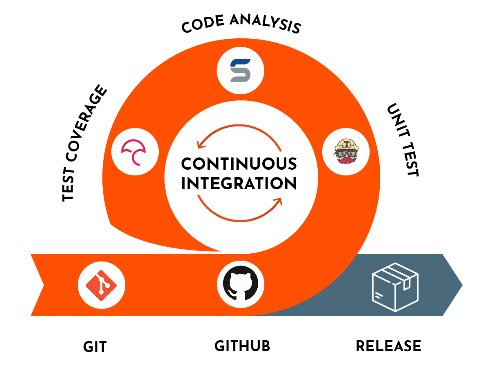
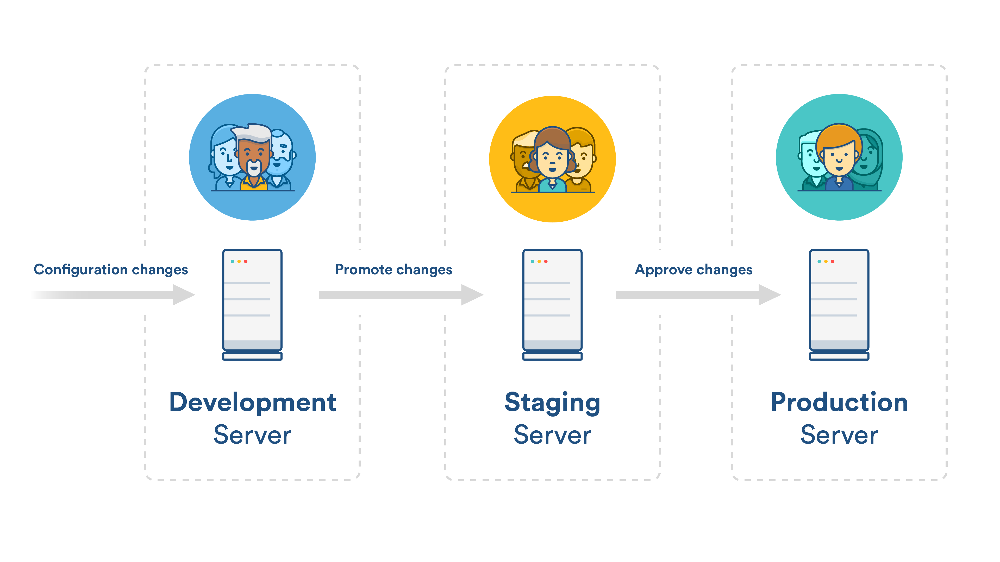
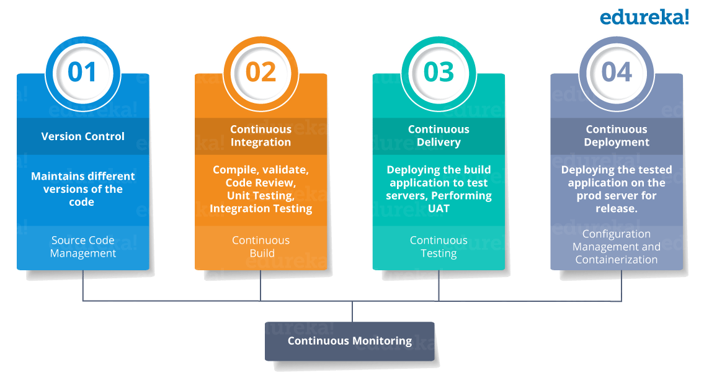

summary: DevOps 101
id: devops101
categories: Sample
tags: devops
status: Published 
authors: Kewei Zhang

# DevOps 101
<!-- ------------------------ -->
## Overview 

DevOps 101 is the foundation course for all students in IT industry. This course covers a full spectrum of knowledge about DevOps, from CI/CD to DevOps culture and best practices how to apply DevOps concepts in real projects.

<!-- ------------------------ -->
## What is DevOps 
DevOps is the combination of cultural philosophies, practices, and tools that increases an organization’s ability to deliver applications and services at high velocity: evolving and improving products at a faster pace than organizations using traditional software development and infrastructure management processes. This speed enables organizations to better serve their customers and compete more effectively in the market.

### A Breif History of DevOps
Patrick Debois is a developer, manager, sysadmin, and tester. He first presented concepts on Agile Infrastructure at Agile 2008 in Toronto, and in 2009 he organized the first DevOpsDays. The idea finally gained more attention in early 2011, and it wasn’t long before enterprises of all sizes were beginning to adopt these new practices.
[A Breif History of DevOps](https://www.bmc.com/blogs/devops-history/)

<!-- ------------------------ -->
## Why Adopt DevOps 
When you implement a DevOps culture, it enables to implement changes effectively and on time

### The Battle - Dev vs Ops
The Dev team that has a goal to ship as many features as possible, kicks a new release “over the wall” to QA. Then the tester’s goal is to find as many bugs as possible. When the testers bring their findings to Dev, the developers become defensive and blame the testers that are testing the environment for the bugs. The testers respond that it isn’t their testing environment, but the developer’s code that is the problem.

Eventually the issues get worked out and QA kicks the debugged new release “over the wall” to Ops. The Ops team’s goal is to limit changes to their system, but they apprehensively release the code and the system crashes. The finger pointing resumes.  

Ops says that Dev provided them faulty artifacts. Dev says everything worked fine in the test environment. The fire drills begin to debug the system and get production stable. The production environment isn’t Dev’s and QA’s responsibility, so they keep hands off while Ops spends all night fixing the production issues. 

### Benefit and Results
**DevOps has been proven to** 
- increase the speed, efficiency and quality of software delivery.
- improve staff morale and motivation.
- removes silos (the communication barriers between teams)
- improve staff collaboration
- improve system reliability
- inspires the confidence to release frequently

<!-- ------------------------ -->
## DevOps Key Components

### Version Control
Version control systems like Git, provide a logical means to organize files and coordinate their creation, controlled access, updating, and deletion across teams and organizations. Version control is closely related to automation. In fact, automation and continuous integration rely on these files for the source code of the automation itself, as well as the configuration to be automated and the data to be distributed.

In particular, version control helps you meet these critical requirements:

- **Reproducibility**. Teams must be able to provision any environment in a fully automated fashion, and know that any new environment reproduced from the same configuration is identical. 

- **Traceability**. Teams should be able to pick any environment and determine quickly and precisely the versions of every dependency used to create that environment. They should also be able to compare two versions of an environment and see what has changed between them.

These capabilities give teams several important benefits:

- **Disaster recovery**. When something goes wrong with an environment—for example, a hardware failure or a security breach—teams need to be able to reproduce that environment in a deterministic amount of time in order to be able to restore service.

- **Auditability**. To demonstrate the integrity of the delivery process, teams must be able to show the path backward from every deployment to the elements it came from, including their version. You enable this through comprehensive configuration management combined with deployment pipelines.

- **Higher quality**. The software delivery process is often subject to long delays waiting for development, testing, and production environments to be prepared. When this preparation can be done automatically from version control, teams can get feedback on the impact of their changes more rapidly, enabling teams to build quality into their software.

- **Capacity management**. When teams want to add more capacity to their environments, the ability to create reproductions of existing servers is essential. This capability enables the horizontal scaling of modern cloud-based distributed systems.

- **Response to defects**. When teams discover a critical defect, or a vulnerability in some component of their system, they need to release a new version of their software as quickly as possible. Storing all artifacts in version control means teams can roll back to a previously verified working state quickly and reliably.

#### Gitflow

#### Infrastructure As Code (IaC)
Infrastructure as code, also referred to as IaC, is a type of IT setup where in developers or operations teams automatically manage and provision the technology stack for an application through software, rather than using a manual process to configure discrete hardware devices and operating systems.

### Continuous Integration (CI)
Continuous Integration (CI) is a development practice where developers integrate code into a shared repository frequently, preferably several times a day. Each integration can then be verified by an automated build and automated tests. While automated testing is not strictly part of CI it is typically implied.

#### CI Lifecycle

#### Why Adopt CI
- Early defect detection
- Reduce overhead
- Better Project visibility
- Reduce assumptions
- Brings quality assurance
- Measureable health of software

### Countinuous Delivery
Continuous delivery (CD) is a software engineering approach in which teams produce software in short cycles, ensuring that the software can be reliably released at any time and, when releasing the software, doing so manually. It aims at building, testing, and releasing software with greater speed and frequency.

### Continuous Deployment (CD)
Continuous Deployment (CD) is a software release process that uses automated testing to validate if changes to a codebase are correct and stable for immediate autonomous deployment to a production environment.

#### Deployment Environments

- Development: 
- Testing: 
- Staging:
- Production: 

### Test Automation 
Test automation. In software testing, test automation is the use of software separate from the software being tested to control the execution of tests and the comparison of actual outcomes with predicted outcomes.

#### Microservices Testing

#### (Advanced) Behaviour Driven Development (BDD) \ Text Driven Development (TDD)
**What is Test-Driven Development (TDD)?**

Test-Driven Development is a testing methodology or a programming practice implemented from a developer’s perspective. In this technique, a QA engineer starts designing and writing test cases for every small functionality of an application. This technique attempts to answer a simple question – Is the code valid? The main intention of this technique is to modify or write a fresh code only when the test fails. Hence it results in lesser duplication of test scripts. This technique is largely popular in agile development ecosystems. In a TDD approach, automated test scripts are written before functional pieces of code. The TDD methodology involves the following steps:

1. Based on the requirements specified in the documents, a developer writes an automated test case
2. These tests are executed, and in some cases, they fail as they are developed before the development of an actual feature
3. The development team then re-factors the code for the test to pass successfully

**Re-factoring refers to the process of modifying the code without changing its main functionality or behavior.**

**Benefits of Test-Driven Development:**
- Helps reduce the amount of time required for rework
- Helps explore bugs or errors very quickly
- Helps get faster feedback
- Encourages the development of cleaner and better designs
- Enhances the productivity of the programmer
- Allows any team member to start working on the code in the absence of a specific team member. This encourages knowledge sharing and collaboration
- Gives the programmer confidence to change the large architecture of an application easily
- Results in the creation of extensive code that is flexible and easy to maintain

**What is Behavioral-Driven Development (BDD)?**

Business-Driven Development (BDD) is a testing approach derived from the Test-Driven Development (TDD) methodology. In BDD, tests are mainly based on systems behavior. This approach defines various ways to develop a feature based on its behavior. In most cases, the Given-When-Then approach is used for writing test cases. Let’s take an example for better understanding:

- **Given** the user has entered valid login credentials
- **When** a user clicks on the login button
- **Then** display the successful validation message
As shown above, the behavior is illustrated in a very simple English language, also known as a shared language. This helps everyone in the team responsible for development to understand the feature behavior.

**Key benefits of Behavioral-Driven Development approach:**
- Helps reach a wider audience by the usage of non-technical language
- Focuses on how the system should behave from the customer’s and the developer’s perspective
- BDD Is a cost-effective technique
- Reduces efforts needed to verify any post-deployment defects

<!-- ------------------------ -->
## Excercise 1

Keep all DevOps Key components in mind and let's walk through one normal day / process of you project lifecycle, see whether you can identify where is CI, where is CD, and try to identify which part of the process can be uplift better applying the DevOps concepts

<!-- ------------------------ -->
## DevOps Processes

### Team experimentation
key components to team experimentation that drive software delivery performance:

- The ability to work on new ideas independently, without having to get permission from outside of the team.
- The ability to write and change specifications during development.
- The ability to make changes to stories and specifications without having to get permission from outside of the team.

Based on these abilities, the following practices can help improve your team experimentation:

- **Empower teams**. Empower teams and allow them to work on new ideas in pursuit of business goals that solve important problems.
- **Provide information and context**. Providing teams with information and context lets teams make informed decisions about the right work to do. Measuring organizational outcomes provides information critical to making the best decisions, so teams are able to achieve expected outcomes and solve problems.
- **Leave the details to those doing the work**. Allow your teams to change stories, specifications, and technologies when they decide it's appropriate. Understand and acknowledge that they are the experts, and empower them to make the technical decisions necessary to get the work done. In the highest-performing teams and organizations, teams are allowed to make informed decisions about the tools and technologies they use.

### Streamlining change approval

Change management processes often include approvals by external reviewers or change approval boards (CABs) to promote changes through the system.

Effective change management policies recognize that different risks are associated with different types of changes. Information Technology Infrastructure Library (ITIL) breaks changes down into three categories:

- Standard changes (low risk, no review required)
- Normal changes (higher risk, require review)
- Urgent changes (emergency and potentially high risk, require review)

You can reclassify most regular changes to standard changes, that is, changes that are pre-approved by the CAB, by having a reliable deployment pipeline in place. That way, your teams can show that changes are fast and reliable over a period of time (such as months or quarters). Teams can deploy without having to wait for approval, which speeds up delivery and deployment time, and improves stability.

Even when you categorize changes as standard, you must record them in change management systems, such as Remedy or ServiceNow. Ideally, you have your deployments performed by configuration management and deployment pipeline tools, which record the results. That way, everyone in the organization can have visibility into changes as they occur.

### Visibility of work in the value stream

Teams that are proficient at this capability have the following characteristics:

- The team understands **how work moves** through the business from idea to customer, including products or features.
- The team has visibility into the **flow of this work**.
- The flow of work, including its current state, is **shown on visual displays** or dashboards.
- **Information about the flow** of product development work across the whole value stream is readily available.

### Working in small batches
Working in small batches has many benefits:

- It reduces the time it takes to get feedback on changes, making it easier to triage and remediate problems.
- It increases efficiency and motivation.
- It prevents your organization from succumbing to the sunk-cost fallacy.

#### INVEST Principle

<!-- ------------------------ -->
## Excercise 2

1. Discussion: Which part of the DevOps process reminds you about Agile / Scrum.
2. Discussion: Give one good example and one bad example about the DevOps process in your current project.

<!-- ------------------------ -->
## DevOps Culture

#### Collaborative Environment
The main theory behind DevOps is to combine development and operations to create a unilateral team that focuses on delivering common objectives. For brands to achieve this, they need to encourage development and operations to regularly communicate, share ideas and problem-solve together. 

Fostering a collaborative environment also involves embracing a cultural shift within a business, and this must start from the “top-down"。

#### End-to-End Responsibility

In the traditional software development model, developers and operations had separate roles. But in DevOps, both groups work as a team that is fully accountable for the application from beginning to end.

#### Automate Everything

To strive for continuous improvement with high cycle rates and the ability to immediately respond to customer feedback, brands must utilize automated processes.

#### Focus on the Customer’s Needs

DevOps requires brands to act like a lean startup that can innovate continuously, pivot when a strategy is no longer working, and invest in features to deliver customer satisfaction. DevOps teams must have one finger on the pulse to consistently meet the needs of ever-changing consumer demands.

#### Embrace Failure, and Learn From it

To fully embrace cloud computing through DevOps, a brand must change their attitude towards failure.

#### Unite Teams — and Expertise

DevOps teams are required to be involved at every stage of the software development lifecycle, from planning, building, deployment, feedback and improvement. This requires a cross-functional team where each member is well-rounded and has a balanced set of skills.  

<!-- ------------------------ -->
## Excercise 3

1. Discussion: Which principles out of the DevOps culture do you think is the most important to the team? Why?
2. Discussion: Give one good example and one bad example about the DevOps culture in your current project.

<!-- ------------------------ -->
## (Advanced) DevOps Measurement

### Monitoring systems to inform business decisions

Monitoring is the process of collecting, analyzing, and using information to track applications and infrastructure in order to guide business decisions. Monitoring is a key capability because it gives you insight into your systems and your work. Properly implemented, monitoring also gives you rapid feedback so that you can quickly find and fix problems early in the software development lifecycle.

Key aspects to effective monitoring:

- Collecting data from key areas throughout the value chain, including application performance and infrastructure.
- Using the collected data to make business decisions.

### Proactive failure notification

Proactive failure notification is the practice of generating notifications when monitored values approach known failure thresholds, and not waiting for the system to alert you it has already failed — or worse, to find out from customers that your application or service is down. Using this approach, you can identify and potentially resolve issues before they become serious or start to impact your users. 

How to implement proactive failure notification
- **Use alerting rules**. You should generate failure notifications using specific alerting rules. Alerting rules define the conditions under which an alert is generated and the notification channel for that alert.

- **Use thresholds**. Alerting rules should use thresholds for the metrics you monitor that indicate real trouble. Monitoring thresholds trigger alerting rules, which generate notifications when metric levels cross threshold values. Choose thresholds carefully. Choose thresholds to only generate alerts when the threshold actually predicts an issue. That is, don't arbitrarily select a value. Generally, you should identify which value levels begin to cause user-facing impact, and then trigger an alert notification at some percentage before that value is crossed.

- **Hold incident post-mortems**. When you hold post-mortems following incidents, determine which indicators could have predicted the incident and monitor them in the future.

- **Plan a notification strategy**. If a notification requires no action or the same action every time, you should automate the response. You should also consider the volume of notifications for events. A deluge of notifications during an event might be distracting rather than useful. When people are exposed to a large number of alarms, they can become desensitized to them (a problem known as "alert fatigue") leading to longer response times or missed alarms. Regularly review notifications and delete those that cannot be acted upon.

### Work in process limits

When faced with too much work and too few people to do it, rookie managers assign people to work on multiple tasks in the hope of increasing throughput. Unfortunately, the result is that tasks take longer to get done, and the team burns out in the process.

Instead, you should do the following:

- Prioritize work
- Limit how much people work on
- Focus on completing a small number of high-priority tasks

### Visual management capabilities

Visual management boards can create a shared understanding of where the team is in terms of its operational effectiveness. They can also help identify and remove obstacles in the path to higher performance.

How to implement visual management

- **Card walls**, storyboards or Kanban boards, either physical or virtual, with index cards that represent in-progress work items.
- **Dashboards or other visual indicators**, such as continuous integration systems with monitors or traffic lights to show whether the build is passing or failing. Effective visual displays are created, updated, and perhaps discarded by teams in response to issues that the team is currently interested in addressing.
- **Burn-up or burn-down charts** (for example, cumulative flow diagrams) showing the cumulative status of all work being done. These allow the team to project how long it will take to complete the current backlog.
- **Deployment pipeline monitors**  showing what the latest deployable build is, and whether stages in the pipeline are failing, such as acceptance tests or performance tests.
- **Monitors showing production telemetry**, such as the number of requests being received, latency statistics, cumulative 404 and 500 errors, and which pages are most popular.

<!-- ------------------------ -->
## Excercise 4

1. Discussion: Thinking about your current project, what DevOps measurement has your project adopted and how does it work?
2. Discussion: Is there any issue in your current project can be resolved by enabling more DevOps capability?

<!-- ------------------------ -->
## (Advanced) DevSecOps

WIP