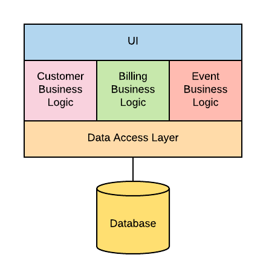

summary: MicroService 101
id: microservice101
categories: Sample
tags: devops
status: Published 
authors: Kewei Zhang

# MicroService 101

<!-- ------------------------ -->
## Overview 

<!-- ------------------------ -->
## What Is Monolithic Architecture
A monolith is a single application that holds a full collection of functionality, serving as one place to store everything. Architecturally, it looks like this:

<!-- ------------------------ -->
## What are Microservices

<!-- ------------------------ -->
## What are Containers

<!-- ------------------------ -->
## What Is Microservices Architecture?
https://dzone.com/articles/why-microservices